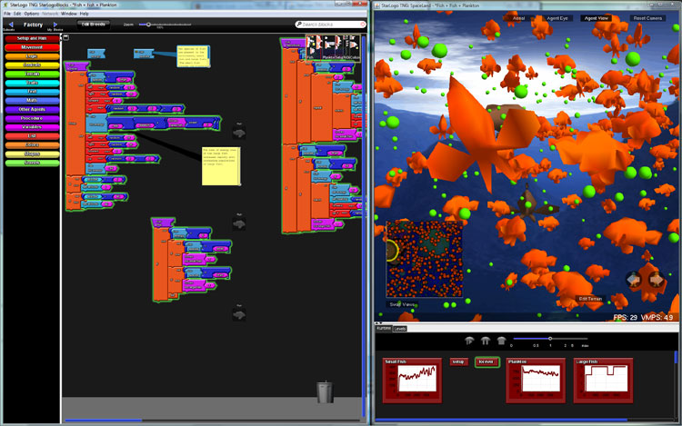
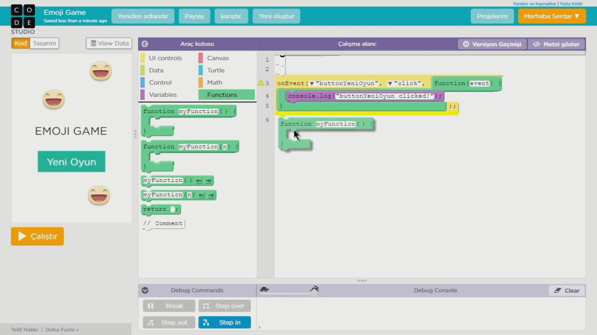
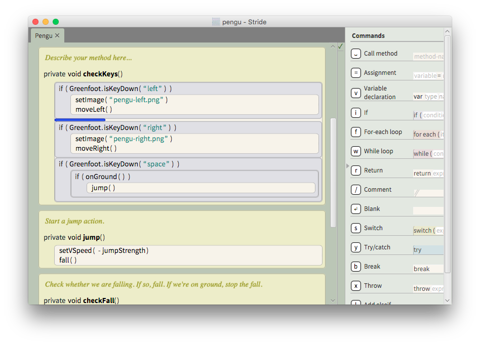
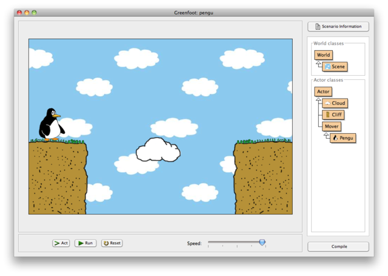
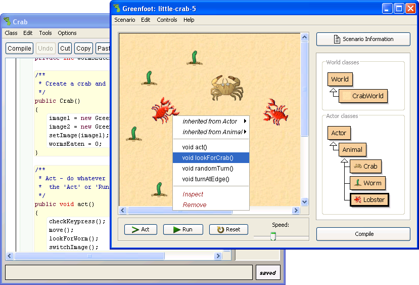
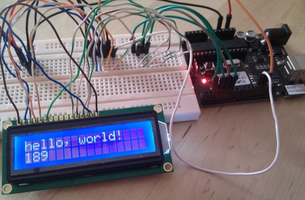
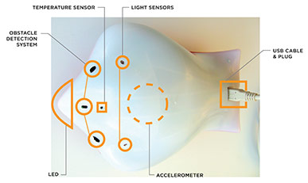
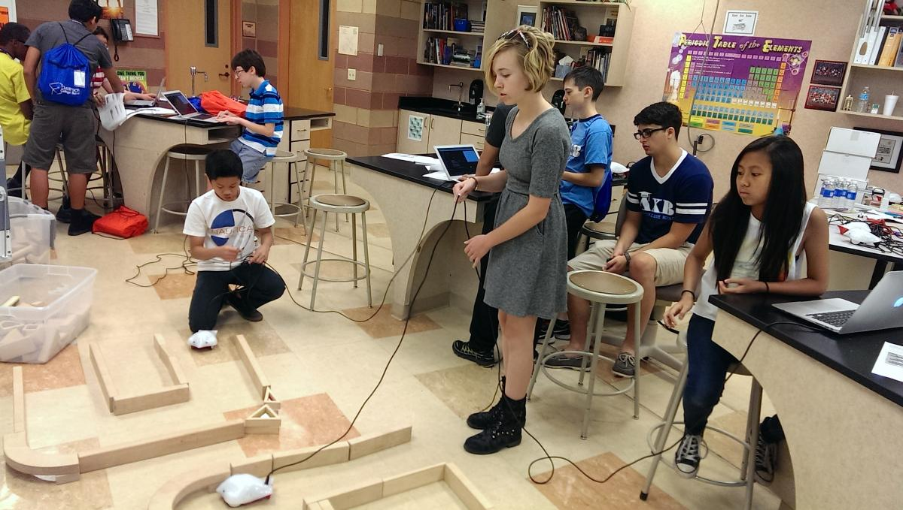

# InformatikUnterricht
Documents and Tasks for my computer science class

## Wege durch den Informatikunterricht mit Herrn Buhl
[Einführung](#einf)  
[1. Wege für Leute mit wenig bis keinen Vorkenntnissen](#1)  
[2. Wege für Leute, die sich mehr mit „Physical Computing“ beschäftigen wollen](#2)  
[3. Wege für Fortgeschrittene](#3)

### Einführung 
In diesem Kurs werden wir versuchen, für Euch möglichst individuelle Wege zu gehen. Grundsätzlich solltet Ihr allerdings in Paaren arbeiten, nur in Ausnahmenfällen möchte ich, dass Ihr zu dritt oder alleine arbeitet. Jedes Paar wird für sich einen Weg aussuchen, diesen begehen, und festhalten. Diese Festhaltung und den von mir wahrgenommenen Fortschritt und Engagement werden die Grundlagen für Eure Note in diesem Kurs bilden. 

Festhalten werdet Ihr Euren Weg, in dem Ihr diesen auf Github dokumentiert. Hier werdet Ihr sowohl Eure Programme bzw. Euren Quelltext als auch Dokumentation hierzu (in der sehr vereinfachten, HTML-ähnlichen Sprache „Markdown“[^1]) ablegen. Ein Beispiel, wie dieses aussehen kann, findet Ihr hier in diesen musterhaften Projekten, die Schüler letztes Jahr in Informatik erschaffen haben:

[^1]: Eine Übersicht, wie man mit "Markdown" die Texte auf Github formatieren und gestalten kann, findet Ihr hier: https://docs.github.com/en/github/writing-on-github/getting-started-with-writing-and-formatting-on-github/basic-writing-and-formatting-syntax
 

    
 Links zu Projektseiten ehemaliger SchülerInnen

 
https://github.com/simonrettmann/Projektseite

https://github.com/ThorgeHamprecht/Informatik-Projekt-Nr.-1/blob/main/2D%20Puzzle%20Game.md

https://github.com/ThorgeHamprecht/InformatikProjektNr.2/blob/main/Projektseite.md

https://github.com/xxxGernchenxxx/rob-the-bot
    
https://github.com/TheMoonlandingV2/TheWeather/blob/main/Projektseite%20Wetterstation.md
    
https://github.com/LeoandTeda/Mirror-Game/blob/master/README.md

https://github.com/murielantonia/The-Beauty-and-Joy-of-Computing

https://olemauss.github.io/LED-Matrix-Arduino/

https://gitlab.com/JKGER/imagerecognition/-/blob/master/Dokumentation/Projektseite.md

https://github.com/dennis602/Projektseite-Arduino-Parkhaus/blob/master/README.md

https://github.com/dennis602/Projektseite-Arduino-Teebeutelautomat/blob/master/README.md

https://github.com/BohrisNaturalisRettner/Projektseite-Spektrometer

https://gitlab.com/JKGER/lothader/-/wikis/Home
    

Ihr werdet ebenfalls ein Stundenprotokoll in Form eines Blogs auf Github führen, um die Prozess und Eure Arbeit zu dokumentieren. Hier Beispiele für gut dokumentierte Stundenprotokolle ehemaliger Stormarnschüler:

    
 Links zu Arbeitstagebüchern ehemaliger SchülerInnen

https://github.com/simonrettmann/Stundenprotokolle

https://github.com/ThorgeHamprecht/Informatik-Projekt-Nr.-1

https://github.com/ThorgeHamprecht/InformatikProjektNr.2/blob/main/Protokollseite.md

https://github.com/xxxGernchenxxx/rob-the-bot/blob/main/Projekttagebuch.md
    
https://github.com/TheMoonlandingV2/TheWeather/blob/main/Stundenprotokoll%20Wetterstation.md
    
https://github.com/dennis602/Stundenprotokoll/blob/master/README.md

https://github.com/dennis602/Stundenprotokoll-II/blob/master/README.md

https://github.com/BohrisNaturalisRettner/Informatikprojekt-Spektrometer-Stundenprotokoll

    
Als Rahmen für Euer Projekt könnt Ihr aus einer breiten Palette an Angeboten einen Weg aussuchen, oder Euren eigenen Weg in Absprache mit mir planen. Im Weiteren werde ich hier bestehende Angebote beschreiben.

### Wege für Leute mit wenig bis keinen Vorkenntnissen
Für Leute mit wenig bis keinen Vorkenntnissen in Programmierung, könnte man/frau mit einen der folgenden Alternativen anfangen:

1. Einen fertigen Kurs von mir mit StarlogoTNG, einer Block-Programmiersprache, um Agenten in einer 3D-Welt zu steuern, der aus einem Satz an konkreten Arbeitsaufträgen besteht.

    

2. Einen Online-Kurs (zumindest z.T. auf Englisch, evtl. gänzlich) mit Applab, einer Block-Programmiersprache, um Apps zu programmieren, der aus einem Satz an konkreten Arbeitsaufträgen besteht. 

    
    
 Siehe hier ein Video:
 
 https://www.youtube.com/watch?v=e1St8LB4VJA
 
 https://www.youtube.com/watch?v=WZVAA3ajZxc
 
 
 https://code.org/educate/applab
 
 Hier ein Projekt mit dem ähnlichen AppInventor von Stormarn-Schülerinnen:
 
 https://drealina.github.io/AppInventor/
 
3. Einen fertigen Kurs von mir über Objektorientierten Programmierung (OOP) mit Stride, einer Frame-basierte Programmiersprache, die eine Zwischenstufe zwischen textbasiertem Java-Programmierung und Blockprogrammierung ist, 

    

 http://www.greenfoot.org/frames/

 in Greenfoot, einer Lehrumgebung für Java, in der man „Akteure“ (Objekte) in einer 2D-grafischen Welt steuert, der aus einem Satz an konkreten Arbeitsaufträgen besteht.

 

4. Selbstgesteuertes Lernen von Objektorientierten Programmierung (OOP) mit Greenfoot, einer Lehrumgebung für Java, einer textbasierten Programmiersprache, in der man „Akteure“ (Objekte) in einer 2D-grafischen Welt steuert.

 
    
Hier ein Greenfoot-Projekt von Stormarn-Schülern:

https://m4nni.github.io/Ants/

5. Einen fertigen Online-Kurs „The Beauty and Joy of Computing”, der erfolgreich sowohl an Universitäten als auch “High Schools” eingesetzt wird, und “Snap!”, eine Blockbasierte Programmiersprache verwendet.

 

 http://bjc.edc.org/

Hier ein BJC-Projekt von Stormarn-Schülerinnen:

https://jasminjarecki.github.io/BJC-Eine-Anleitung/

###  Physical Computing

Wege für Leute, die sich mehr mit „Physical Computing“, d.h. die Steuerung von physikalischen, echten Geräten, wie LEDs, Motoren, Schaltungen, oder Robotern etc., auseinandersetzen und noch selbstständiger Arbeiten wollen bzw. können, gibt es drei Möglichkeiten:

1. Sich mit dem Arduino auseinandersetzen. Hierzu selbstständig Tutorials und Projekte aussuchen

 

 https://www.arduino.cc/  

Hier sind einige Arduino-Projekte von Stormarnschülern:
 
 

    
 Arduino-Projekte ehemaliger SchülerInnen

 
 https://github.com/simonrettmann/Projektseite
 
 https://github.com/xxxGernchenxxx/rob-the-bot
 
 https://github.com/TheMoonlandingV2/TheWeather/blob/main/Projektseite%20Wetterstation.md
    
 https://stormarnschule12.github.io/Arduino-car/

 https://olemauss.github.io/LED-Matrix-Arduino/
 
 https://github.com/lakgiter/Informatik-Projekt-3
 
 https://github.com/lakgiter/Projektpraesentation-3
 
 

    
Folgende Links sind youtube Videos, die zeigen, was man so mit einem Arduino machen könnte:

  
 
  
 
 

2. Wer schon Programmier- und evtl. Netzwerkerfahrung besitzt, könnte sich mit dem RaspberryPi auseinandersetzen. Siehe dazu die Beispiele aus dem letzten Jahr, die oben bei den Angaben zum Github stehen.

 http://stormarnschule.github.io/

 https://github.com/stormarnschule

3. Wer sich mehr mit der Steuerung von Robotern beschäftigen möchte, und selbstständig arbeiten kann, könnte sich mit dem Finch und einem Online-Kurs dazu auseinandersetzen:

 

 

 http://finchrobot.com/teaching/grades-9-12

 Dies kann sowohl blockbasiert (Snap! s.o.) als auch textbasiert mit Java erfolgen:

 http://finchrobot.com/software-overview  
 http://finchrobot.com/teaching/snap-grades-9-12  
 http://finchrobot.com/teaching/introduction-programming-finch  

### Wege für Fortgeschrittene
Leute mit richtigen Vorkenntnissen, die auch sehr selbstständig arbeiten können, könnten Ihr eigenes Projekt in Absprache mit mir festlegen. 
